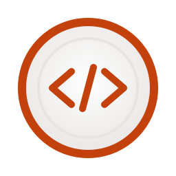

<p align="center">
  
</p>

<h1 align="center">Plate</h1>

<p align="center">A lightweight PHP templating engine inspired by Laravel's Blade.</p>

---

## Features

- Simple, expressive syntax with `{{ }}` delimiters
- Automatic output escaping for security
- Conditional rendering with `if`, `elif`, and `else`
- Loop support with `each`
- Raw PHP execution within templates
- Compiles to plain PHP for optimal performance

## Requirements

- PHP >= 8.4

## Installation

```bash
composer require leonickl/plate
```

## Usage

```php
<?php

require 'vendor/autoload.php';

use LeoNickl\Plate\Plate;

// Compile a .plate file to PHP code
$phpCode = Plate::file('view.plate');

// Cast to string to get the compiled PHP
echo (string) $phpCode;
```

## Template Syntax

### Printing Values

```plate
{{ "hello" }}              // Escaped output
{{ ==$html }}              // Unescaped output
{{ "hello", "world" }}     // Multiple expressions (joined with space)
{{ :$var = "test" }}       // Execute PHP without printing
```

### Conditionals

```plate
{{ if: $condition }}
    <p>Yes!</p>
{{ elif: $other }}
    <p>Maybe!</p>
{{ else: }}
    <p>No!</p>
{{ if; }}
```

### Loops

```plate
{{ each: $items as $item }}
    <p>{{ $item }}</p>
{{ each; }}
```

## Example

See `example.plate` for a complete example. Run it with:

```bash
php index.php | php
```

This compiles the template and executes the resulting PHP.

## Syntax Highlighting

Available for VSCode [leonickl/plate-vscode](https://github.com/leonickl/plate-vscode.git)
